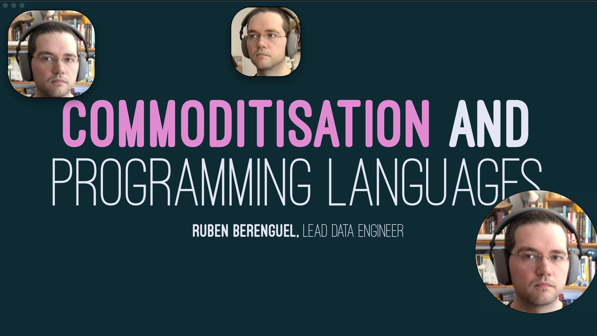
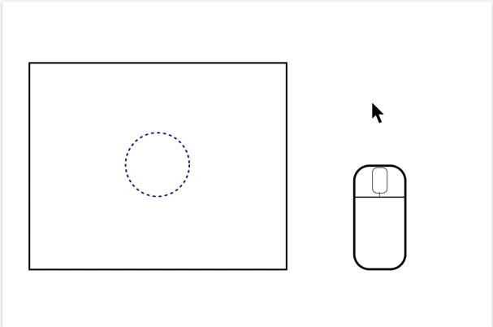

# Guillotine

- [Guillotine](#guillotine)
  - [Caveats](#caveats)
  - [Installation](#installation)
  - [Why Electron?](#why-electron)

Recording a presentation while showing your webcam is sometimes a bit tricky. You can get by with [OBS](https://obsproject.com), but it's a bit overkill when you just want to give a talk from time to time.

Guillotine is an Electron (sorry) application to solve this. It allows you to have up to 9 floating, always-on-top windows showing a live view from any of your webcams.

_NOTE_: On MacOS you will need to have the presentation in a window (since full screen apps don't allow anything on top of them).

</a>

Here you can see a small animation of how to use it. I've tried to make it as easy as possible, at least as long as you have a mouse with scrollwheel. If that's not the case, there are also keyboard controls to resize everything.

## Caveats

* I have only checked this works _on my Mac_ and on a Windows virtual machine. I'll do my best to make it work for as many systems as possible, but my time is limited.
* I have faced some transparency issues on MacOS: the floating window sometimes loses transparency (when either the border radius is not 50% or the displacement is a floating point). I have fixed the first by setting the window at _very_ low opacity, the second by converting to integers. If your floating window is not transparent let me know.
* In Linux, you should put `--enable-transparent-visuals --disable-gpu` in the command line to disable GPU and allow ARGB to make transparent window (according to the [Electron documentation](https://www.electronjs.org/docs/api/frameless-window#limitations)). I haven't tried

## Installation

You should find packages for Windows, Mac and Linux in the [releases section](https://github.com/rberenguel/Guillotine/releases)
 
## Why Electron?

Anybody that knows me at all is aware I'm not a fan of Electron applications. Large, bloated, slow. I had been wanting something like Guillotine for a long time, and eventually checked how hard it would be. I investigated how to do the basics with Swift, and it looked _doable_ given a lot of time. I don't have a lot of time, but wanted to create this: 
- I finished this in Electron in a week. 
- It's not the prettiest app (or icon, I'm not a designer!).
- It doesn't even have tests (ugh!) 
- BUT gets the job done (on my machine at least)

---

